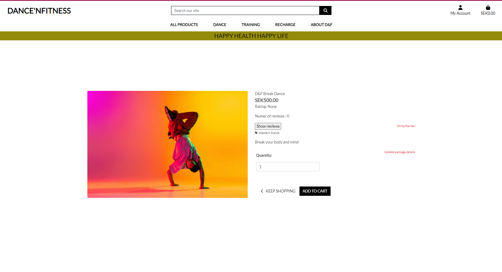

# Madison's Patisserie - Online Bakeshop
<br>
<hr>

<h3 align="center">Full-Stack Project- E-Commerce(HTML5, CSS3, Bootstrap, Django, Python, JavaScript, jQuery, PostgreSQL, Cloudinary, Heroku)</h3>


TABLE OF CONTENTS

  - [Overview](#overview)
  - [UX](#ux)
  - [Business Model](#business-model)
  - [Marketing](#marketing)
  - [Agile Methodology](#agile-methodology)
  - [Features](#features)
  - [Responsive Layout and Design](#responsive-layout-and-design)
  - [Tools Used](#tools-used)
  - [Testing](#testing)
  - [Deployment](#deployment)
  - [Credits](#credits)
  - [Acknowledgements](#acknowledgements)

## Overview
DanceAndFitness is an e-commerce website created for a fictive Fitness center, located in Älmhult, Sweden. The main purpose of the project was to implement a fully functional online system so  that will make the process of selecting and purchasing fitness center packages for all.<br>
The users are given the possibility to see every package details, Read reviews, add items to the shopping cart, purchase with an online payment and access orders' history. Also, the site admin have opportunity to add new package/set new price and descriptions of a package if necessary.<br>
The website was developed using Python(Django), HTML, CSS and JavaScript. The data was stored in a PostgreSQL database using ElephantSql for manipulation.
<br><br>
The fully deployed project can be accessed at [D&F](https://dancenfitness-708b83044c2d.herokuapp.com/).<br><br>

## UX
This site was created respecting the Five Planes Of Website Design:<br>
### Strategy<hr>
**User Stories:** <br>

|   EPIC                                ||                                User Story                                                   |
| :-------------------------------------|--|:------------------------------------------------------------------------------------------- |
|**Base Setup**             |  ||
|                                       || As a user, I want to understand the purpose of the website from the first interaction with its content |             
|                                       || As a user, I want to be able to easily use the site functionalities on all viewports, so I can shop the products from any device|
|                                       || As a user, I want to see a footer with relevant information and documents|
|                                       || As a user, I want to be able to access a navigation menu at any time, so I can easily navigate through the website content|
|                                       || As a user, I want to be able search through site products by entering a key word|
|**AUTENTHICATION**   |  || 
|                                       || As a user, I want to be able to register on the website|
|                                       || As a user, I want to be able to confirm my account with an email|
|                                       || As a user/admin, I want to be able to authenticate using only email and password|
|                                       || As a user, I want to be able to reset my password in case I forgot it|
|                                       || As a user/admin, I want to be able to log out at any time|
|**PRODUCTS**                           |  ||
|                                       || US - As a user, I want to see a catalog with all the products and also grouped by categories|
|                                       || US - As a user, I want to be able to apply filters and to sort the listed products, so I can easily find the ones I am interested to buy|
|                                       || US - As a user, I want to be able to see the stock availability for low stock products|
|                                       || US - As a user, I want to see a page with full specifications for every product, so I can easily decide which one I would want to buy|
|                                       || US - As a user, I want to be able to add any product to the shopping bag in a selected quantity|
|                                       || US - As an admin, I want to be able to edit product details|
|                                       ||  US - As an admin, I want to be able to delete products from the catalog, so it reflect the existent stock|
|                                       || US - As an admin, I want to be able to add new products to catalog, so it reflects the existent stock|
|**RATING&REVIEWS**                            |  ||
|                                       || US - As a user, I want to be able to see all the reviews added for any product, so I can easily make an opinion about its quality|
|                                       || US - As a logged in user, I want to be able to add a review for any product I want|
|                                       || US - As a logged in user, I want to be able to see and edit my reviews added to products|
|                                       || US - As a user, I want to be able to see a general review of every product|   
|**CART**                                |  ||
|                                       || US - As a user, I want to see all the products I added to the shopping bag|
|                                       || US - As a user, I want to be able to add/remove from the wishlist any product from the shopping bag|
|                                       || US - As a user, I want to see all the details about the price for the order|
|                                       || US - As a user, I want to be able to remove a product from the shopping bag|
|                                       || US - As a user, I want to be able to edit the quantity of the products|
|                                       || US - As a user, I want that all the discounts announced on the website to be applied properly|
|                                       || US - As a user, I want to be able to add my vouchers to the order|
|**CHECKOUT&PAYMENT**                           |  ||
|                                       || US - As a logged-in user, I want to be able to see and edit my default delivery details for the order|
|                                       || US- As a user, I want to see the order summary with all the price details|
|                                       || US - As a user, I want to be able to add my delivery details for the order|
|                                       || US - As a user I want to be able to introduce my card details for payment|
|**USER MANAGEMENT**                       |  ||
|                                       || US - As a logged in user, I want to be able to see and edit my delivery details|
|                                       || US - As a logged-in user, I want to be able to see my orders history|
|                                       || US - As a logged-in user, I want to see the full details for every order I placed on the website
|**Testing & Documentation**                |  ||
|                                       || US - As a user, I can easily navigate to the website's FAQs page.|
|                                       || US -As a user, I can get all the answers to frequently asked questions about the bakeshop and their products without needing to contact them.|


**Project Goal:**<br>
Create an e-commerce application for DanceAndFitness that is useful for clients and staff members as well.

**Project Objectives:**<br> 
* To create a website with a simple and intuitive User Experience;
* To add content that is relevant and helps create a better image of the fitness center;
* To differentiate between user and admin accounts;
* To implement fully functional features that will ease the site admin to add new packages and exciting offers;
* To make a fully responsive website available and functional on every device.<br><br>

### Scope <hr>
**Simple and intuitive User Experience**<br>
* Ensure the navigation menu is visible and functional at every step;
* Ensure every page has a suggestive name that fits its content;
* Ensure the users will get visual feedback when navigating through pages;
* Create a design that matches the requirements of an e-commerce website.

**Relevant content**<br>
* Add a representative cover image;
* Add the website title and details about its purpose;
* Add a section that includes information about the center's name, description, location and contact details;
* Make a clear and beautiful designed presentation of the menu elements;

**Features for upgraded experience**<br>
* Create a list with all the products and group them by category;
* Create a Bag feature that allows the user to add, update and remove products from the shopping bag;
* Create a Wishlist feature that gives the user the possibility to add and remove items from the wishlist;
* Create a Review feature that displays all the reviews added for a product and allows the user to add and edit his review;
* Create a Checkout feature for giving the user the possibility to complete an order on the website;
* Create a Profile page for the user to add/update his delivery details and see his orders' history;
* Create a Newsletter feature that allows the user to subscribe with his email;
* Create a Voucher feature that offers the user a dicount code on account registration;
* Create a page for the staff members to manage all the orders for all the users;
* Create a feature for the staff members to add/edit products on the website;

### Structure<hr>
The structure of the website is divided into multiple pages and the content is displayed depending on authentication and client/admin type of user. <br>
- **Register/Login** pages give the user the possibility to create an account and authenticate for accessing different features.<br>
- **Logout** feature is a modal that helps user exit their current account;<br>
- The **Home** page is visible for both types of users and includes relevant information about the websites' purpose and details a bout the bakeshop, location and contact;<br>
-The **All products** page displays a list with all the products available for selling;<br>
- The **Cakes** navigation link gives the user the possibility to access the list of products grouped by category, <b>Fresh Cream Cakes</b>, <b>Buttercream Cakes</b>, <b>Drip Cakes</b> and <b>Celebration Cakes</b>;<br>
- The **Celebration/Occassion Cakes** page lists the products categorised as <em>Birthday</em>, <em>Wedding</em> and <em>Custom Made Cakes</em>;
- The **Product details** page displays full specifications for a product and gives access to the <b>Review</b> feature. It also includes a feature for updating the shopping bag for users that are not admins. Staff members have access to the feature for editing/removing current product;<br>
- The **Profile** page is only available for authenticated users that are not admins and gives access to personal delivery details and orders' history;<br>
- The **Profile order details** page gives access to the user to full specifications only for orders placed by him.<br>
- The **Wishlist** page contains a list with all the products added by the user and cannot be accessed by guest or admin users;<br>
- The **Bag** page displays all the items added in the shopping bag with associated features;<br>
- The **Checkout page** includes an order summary and a form for personal, delivery and payment details;<br>
- The **Checkout success** page displays full specification for the successful order;<br>
- The **Orders** page gives access only to staff members and displays all the bookings registered, grouped and filtered by day.<br>
- The **Admin order details** page gives access only to staff members to full specifications for any order.<br><br>

**FLOWCHARTS**<br>
The Flowchart for my program was created using <b>LucidChart</b> to help me keep track and visually see how the system works. Due to the nature of development, and room for creativity, the final website has minor 
deviations from this flowchart. To be specific, the addition of three more features: "About", "Faqs" and "Contact".<br><br>
<br><br>

### Skeleton<hr>
**Wireframes**<br>
The wireframes for mobile and desktop were created with [Balsamiq](https://balsamiq.com/) tool. 

<details>
  <summary>Home</summary><br>
  Desktop<br>
<br>
  Mobile<br>
<br>
</details>
<details>
  <summary> Products Page</summary><br>
  Desktop<br>
<br>
 Mobile<br>
<br>
</details>
<details>
  <summary> About us Page</summary><br>
  Desktop<br>
<br>
 Mobile<br>
<br>
</details>
<br><br>


**Database**<br>
The project uses the PostgreSQL relational database for storing the data.
Due to the nature of development, and room for creativity, the final website has minor 
deviations from this schema. To be specific, the addition of three more features: "About", "Faqs" and "Contact".<br>

<details>
  <summary> Schema</summary>
<br>
</details>


### Surface<hr>
#### Color Scheme
All the colours were selected generated from the hero image using Coolors
<br>

#### Fonts
* The fonts I used for this site were imported from [Google Fonts](https://fonts.google.com/):<br>
**Body:** *Alice, serif*<br>
**Logo:** *Yesteryear, cursive*<br>
**Custom error page:** *Josefin Sans, sans-serif*

## Business Model

* The business model chosen for this project is <b>Business to Customer</b>, as the main purpose of the website is to deliver final products to customers. This model was implemented using an interactive, attractive and intuitive interface that gives the clients an upgraded experience for shopping.<br><br>


* The online bakeshop offers a diverse selections of baked products categorised as *All Products*, *Cakes*(Cakes are further sub-categorised to drip cakes, buttercream cakes, chocolate cakes and occassion cakes), *Desserts*, *Sweet Treats* and *Everyday Esssentials*. Customers can order any quantity of the products within the limit of available stock.
* The bakeshop also have a Cork Bakeshop Cafe, where customers/clients can relax and enjoy their favourite sweet treats with a cold or hot beverage of their choice. They also have an option to purchase all their favourites as the cafe stock all the bakeshop products on site. 

## Marketing

### Facebook Page
* The marketing strategy includes a Facebook business page that is intended to create a good image of the bakeshop by posting news and promotions available. By highly promoting the products and always adding new content, the page will increase its popularity and attract more and more customers to buy from the online store. The page can be accessed at [this link](https://www.facebook.com/profile.php?id=61553025716191).<br><br><br>
*Note, this link may be broken as facebook regularly deletes inactive business pages.


### Newsletter
* Newsletter is also utilised as a marketing strategy in an attempt to improve customer engagement further, keeping them up to date and also incentivising them by running promotions on regular basis.<br><br>


## Search Engine Optimisation

I have created a sitemap and robots.txt file to help aid search engines locate the site. To keep user's information safe, any pages that could contain sensitive information has been disallowed in the robots.txt.

The purpose of the About Us page was not so much designed in mind to inform the user, but more so to have an opportunity to use some keywords, and link the user to any other relevant website, all to help boost the site's ranking in search engine results.

The initial keywords and phrases I came up with were:<br>
### Short Tail Keywords
 * Cakes Cork
 * cork bakeshop
 * sweet treats
 * desserts
 * wedding cakes
 * occasion cakes
 * birthday cakes
 * pies
 * doughnuts
 * drip cakes
 * chocolate cakes
 * elegant cakes
 * christening cake <br>

### Long Tail Keywords
 * scrumptious cakes
 * shop cakes online
 * cake delivery in cork
 * custom-made cakes

[Back to top ⇧](#overview)

## Agile Methodology
This project was developed utilising the Agile Methodogy.<br>
 I prioritized features by labeling them such as "must-have", "could-have", "future enhancement", "backlog" and "bugs" among others and moved some less critical ones to future development. To guide my development process, I created user stories for both the admin/staff user and guests/clients/customers. These stories helped to define the features and functionalities that were most important to project's target audience.

As a student solo developer who was learning a lot during development, I faced challenges in estimating the time required for each task and only had a basic concept of what I would be able to create at a given timeframe. Therefore, I kept things simple and focused on achievable goals. Aiming for Minimum Viable Product, or MVP. All the features and functionalities that I wanted to have but I didn't manage to finish because of time constraints were moved to "Future Enhancement". With the goal of implementing them on the projects future release.

To keep track of progress, I used Github Projects(https://github.com/users/Aylamccarthy/projects/5). I used a kanban board (https://github.com/users/Aylamccarthy/projects/5/views/1?layout=board) divided into following sections: "to do", "in progress" "done", "backlog", "future enhancements" and "bugs" that allowed me to visualize all tasks and prioritize next steps. However, I could not find the "epics" feature in GitHub Projects, only milestones (it provides only [milestones and issues](https://docs.github.com/en/issues/tracking-your-work-with-issues/about-issues)). Epics are supposed to be larger in scope than milestones, representing a significant amount of work. Milestones, on the other hand, are meant to mark significant points in time in terms of project completion. In this document, I added epics, but on the project board, I used only [milestones]() to stay in order with GitHub's features.

By using Agile methodology, I was able to stay organized, work efficiently and focused on delivering the most important features, while also allowing flexibility for future development. This experience gave me invaluable insight and lessons that I can apply to future projects.


<br> <br>


| Epic | Milestone | User stories |
|------|-----------|--------------|
| Epic 1: BASIC SITE FUNCTIONALITY| Milestone 1: Project SetUp |  [#1](https://github.com/Aylamccarthy/madisons-patisserie/issues/1) [#2](https://github.com/Aylamccarthy/madisons-patisserie/issues/2)
|  |Milestone 2: Content and Navigation |[#3](https://github.com/users/Aylamccarthy/projects/5?pane=issue&itemId=38882996) [#4](https://github.com/users/Aylamccarthy/projects/5?pane=issue&itemId=38883390) 
|   |Milestone 3: User Registration/Authentication   | [#5](https://github.com/users/Aylamccarthy/projects/5?pane=issue&itemId=38883534)  [#6](https://github.com/users/Aylamccarthy/projects/5?pane=issue&itemId=38884037) [#7](https://github.com/Aylamccarthy/madisons-patisserie/issues/7)
| Epic 2: USER MANAGEMENT| Milestone 4 : Products | [#10](https://github.com/Aylamccarthy/madisons-patisserie/issues/10) [#11](https://github.com/Aylamccarthy/madisons-patisserie/issues/11)
|   |Milestone 5: Reviews | [#12](https://github.com/Aylamccarthy/madisons-patisserie/issues/12) [#13](https://github.com/Aylamccarthy/madisons-patisserie/issues/13)
|   |Milestone 6: Wishlist | [#14](https://github.com/Aylamccarthy/madisons-patisserie/issues/14) [#9](https://github.com/Aylamccarthy/madisons-patisserie/issues/9)
| Epic 3: CONTENT MANAGEMENT| Milestone 8: Bag  | [#15](https://github.com/Aylamccarthy/madisons-patisserie/issues/15) [#16](https://github.com/Aylamccarthy/madisons-patisserie/issues/16)
|   |Milestone 9: Checkout | [#17](https://github.com/Aylamccarthy/madisons-patisserie/issues/17) [#18](https://github.com/Aylamccarthy/madisons-patisserie/issues/18)
| Epic 4: USER PROFILE and ADMIN| Milestone 9: User Profile| [#19](https://github.com/Aylamccarthy/madisons-patisserie/issues/19) [#20](https://github.com/Aylamccarthy/madisons-patisserie/issues/20)
|   |Milestone 10:Admin Manage Orders| [#21](https://github.com/Aylamccarthy/madisons-patisserie/issues/21) [#22](https://github.com/Aylamccarthy/madisons-patisserie/issues/22) [#23](https://github.com/Aylamccarthy/madisons-patisserie/issues/23)
| Epic 5: COMPREHENSIVE TESTING and PROJECT WRAP UP| Milestone 11: Comprehensive Testing and Code Validations| [#8](https://github.com/Aylamccarthy/madisons-patisserie/issues/8) [#24](https://github.com/Aylamccarthy/madisons-patisserie/issues/24)
|   | Milestone 12: Refactoring and Final deployment| [#25](https://github.com/Aylamccarthy/madisons-patisserie/issues/25) [#26](https://github.com/Aylamccarthy/madisons-patisserie/issues/26)
|  

<details>
<summary><strong>Sprints Details</strong></summary>

* **Sprint 1 - SETUP**<br>
    -Setup Django<br>
    -Deploy on heroku<br><br>
* **Sprint 2 - VIEWING AND NAVIGATION**<br>
    -Add website name, logo, slogan and description<br>
    -Choose colours, fonts and decorative images <br>
    -Create a navigation menu<br>
    -Implement the search feature<br>
    -Add footer with social media links
    <br><br>
* **Sprint 3 - USER REGISTRATION/AUTENTHICATION + NEWSLETTER**<br>
    -Implement the *Register* page using the django-allauth module<br>
    -Implement the *Login* page using django-allauth module<br>
    -Implement *Logout* modal using django-allauth module<br><br>
    -Implement email confirmation using django-allauth module<br>
    -Implement password reset using django-allauth module<br>
    -Add a form for the users to subscribe to the newsletter
    <br><br>
* **Sprint 4 - PRODUCTS**<br>
    -Create *Products* pages, with all items or grouped by category<br>
    -Create a list of products<br> 
    -Implement filtering and sorting features<br>
    -Implement a feature for adding products to the shopping bag<br>
    -Create *Product Details* page with full specifications<br>
    -Add a feature for adding products to the shopping bag from the *Details* page<br>
    -Implement feature for admin to delete product<br>
    -Implement features for admin to add/update product<br>
    -Add validation for add/update product forms
    <br><br>
* **Sprint 5 - REVIEWS**<br>
    -Implement a form for adding and updating reviews on the *Product Details* page<br>
    -Add a section that displays all the reviews for the product<br>
    -Implement feature for product's general rating
    <br><br>
</details><br><br>


## Features
### Existing Features<hr>
#### Products
Every user can access the page with the product catalogue. The items are listed attractively and their design is adapted to all devices.

* On every page with a catalogue of products, there is a section for filtering and sorting.<br>
    The filters can be selected from a dropdown with all the values existing in the list of items displayed. When a user selects a filter, its value is added to a list of *active filters* and the list updates accordingly. Any active filter can be removed and the list will return to its initial state.<br><br>
    <br><br>

    The sorting feature is available for the user by selecting a value from the available options that will update the products' list accordingly.<br><br>
    <br><br>

* All the products are listed as hoverable elements which include relevant information for the users. The items with low stock have a banner to announce the user about their availability.<br><br>
<br><br>

* Every products has a *details page* that includes full specifications.<br><br>
<br><br>

#### Product Reviews
* On the *Product Details* page there is a list with all the reviews posted on the website and it is visible to all types of users. All the reviews have the same design and type of content. Important details are displayed such as *Name*, *Date and time*, *Stars rating* and the *Message* posted.<br><br>
<br><br>

* When a user is authenticated and he never posted a review, a form is provided for leaving a message and a star rating.<br><br>
<br><br>

* For authenticated users that already posted a review, the page displays the values of their review and the possibility to update it.<br><br>
The form for editing the review already contains the corresponding message value and the star ratings in the initial state.<br><br>
<br><br>
<br><br>

#### Wishlist
* On the *Product Details* page there is an interactive feature that is only available for logged-in users that are not staff members. A user has the possibility to add a product to the wishlist through a form that uses a heart icon as a button. The heart shape defines the state of the product in the wishlist database. This feature is also accessible on the *Bag* page.<br><br>
<br><br>
<br><br>

* In the *Wishlist* page there are listed all the favourite items of the user with a design similar to the one created for the *Products* pages. A filtering and sorting section is also available and every element is linked to a *Product Details* page.<br>
An additional feature would be that every item includes a representation of the number of times it has been added to the wishlist by all the users.<br><br>
<br><br>

#### Bag
* A feature for adding a product to the shopping bag has been created and included in the *Products*, *Product Details* and *Wishlist* pages. This is a form for updating the products existing in the shopping bag and also their quantity.
* In the *Bag* page there's a list of the added items with details about quantity and price. Any item can be removed by clicking on the bin icon and also the quantity can be updated.<br><br>
<br><br>

* A section for applying a voucher code has been implemented. Whenever a user registers on the website, an email with a 20% discount voucher code is sent automatically to the user via email. The code can be used in the shopping bag for a 20% discount. The voucher can be applied and also removed before proceeding to checkout. The code can be used only be used once by the account holder.<br>
When the order total cost doesn't reach the value specified (€50) on the website for *free delivery*, a message will be displayed to inform the user about the remaining value to be added to be able to avail of free delivery service (calculated as 10% from the order total).<br><br>
<br><br>
<br><br>
<br><br>

#### Checkout
* The *Checkout* page represents the final step in completing the order.<br>
A form for personal, delivery and payment details is displayed for the user to fill in with valid data. As the delivery is available only for Cork - Ireland, the fields *Country, County and City* are filled by default with values and can't be edited by the user from the interface. Additionally, a validation has been implemented to not allow other values to be submitted. The form has validation for the phone number field as well to match an Ireland format. The payment input has its own Stripe-implemented validation.<br><br>
<br><br>
* An order summary is displayed with details about the products and cost.
* After the order is completed, the user is sent to a *Checkout Success * page with full specifications and details.

#### Payment
* Underneath the delivery details is the card payment box which is run by Stripe.
* Only numbers can be entered into the card payment box. Incorrect card numbers will automatically show an 
  invalid card number error.
* The site can be tested by using the dummy card number 4242 4242 4242 4242 with the expiry date 04/24 and the CVC code 242.
* At the end of the section is a button to complete the order or to return back to the bag. There is also a warning message informing the user of how much their card is about to be charged.<br><br>
<br><br>

#### Loading Spinner
* Upon clicking the complete order button, as long as the form is valid, a loading spinner will render until the information is processed completely.<br><br>
<br><br>

[Back to top ⇧](#overview)
#### Webhooks
* Using the Stripe website, webhooks have been set up to confirm an order goes through after payment.
* Once an order is placed, a webhook will search the database to confirm the order exists. If it cannot find the  original order, it will create one using the information provided by the user in the original instance.<br><br>
<br><br>

#### About Us
* The about us page features an image of the fictional founder of Madison's Patisserie and her daughter.<br><br>
<br><br>

* On the left hand side of the image are some fictional information of how Madison's Patisserie came to be. This was used to create an opportunity to use keywords related to the site's business to help boost search ratings.<br><br>
<br><br>

#### Contact
* The contact page has the image of the fictional cafe of the bakeshop. The contact info has all the relevant information such as address, telephone number and email address.
* It also contains the cafe's  opening hours as well as google map that has the marker set to the fictional address of the bakeshop's cafe.
* The *Contact* page was created with the aim of providing the users all the relevant information about the bakeshop's contact details, opening hours and location without needing to contact the bakeshop.<br><br>
<br><br>


#### User Profile
The *User Profile* page gives the user access to individual and private features.<br>
* The page includes a form for adding or updating the delivery details. These details are saved in the database and whenever the user is logged in and wants to make an order, the values will be automatically set in the checkout form. <br><br>
<br><br>

* Another important feature is the **Orders history** which is represented by a table with all the orders made by the user. <br><br>
<br><br>
Each order item has a details page that can be accessed by clicking on the order number value.<br><br>
<br><br>

#### Admin
The admin account was created as a superuser account from the terminal and also has access to the admin panel.<br>
* There is a page created especifically created for staff members to keep better track of all the orders placed on the website.<br>
<br><br>
The orders are displayed in a custom-designed table, grouped by day and ordered by time. The page renders by default the orders for the current day. 

* A form is provided for filtering the orders by date for a better user experience.<br><br>
<br><br>

* Every order has a delete button that triggers a confirmation modal and gives access to a full details page by clicking on the order_number value <br><br>
<br><br>

* An admin user have access to features for *adding a new product*, *edit a product's details* and *delete product*. 
<br><br>

* The last two implementations are available on the *Product Details* page and only for staff accounts.<br><br>
<br><br>
<br><br>

#### FAQs Page
The *FAQs* page was created with the aim of providing the users all the relevant information  and answers to all their frequently asked questions without needing to contact the bakeshop.<br><br>
<br><br>

#### Toasts
* Toasts appear in the top right-hand corner of the display informing the user of any actions they have performed.
* The top part of the toast box will change colour depending on whether the message is portraying a successful action, general info, warning, or an error.<br><br>
<br><br>

### Future Feature Considerations<hr>

* Because of increasing demand for bespoke wedding cakes, the bakeshop will implement a dedicated page specifically for wedding cakes and wedding related products. This feature will include a gallery of all the wedding cakes, customer testimonials, and a request a quote/call back form that the customers can fill out and send. This feature was planned to be implemented for this project but couldn't be done because of time constraints. It is also visible on the *Github Project* kanban board where iit is labelled as *could have* and *enhancement*.
* Implementing a chat feature for communication between customers and staff members. This would be useful for any client that has an issue on the website and also will create a better and faster way of finding solutions. 

* Creating a feature for easily sending email advertisement to the customers. This would be a default template form to be filled and the email will be automatically sent to the customers. 

* Expanding the voucher feature by implementing a points reward system for loyal customers that shop frequently from the website. The customer will be rewarded points for every purchase, which they can convert into a voucher that can be redeem with their purchases.

## Responsive Layout and Design
The project design has been adapted to all types of devices using Bootstrap predefined breakpoints. For intermediate devices where the design didn't fit accordingly, custom breakpoints were used.

**Breakpoints:**

    - max-width:380px(extra small devices)
    - max-width:768px(small devices)
    - max-width:992px(medium devices)
    - min-width:1024px and max-width: 1024px(IpadPro)
    - max-width:1200px(large devices)

**Tested devices:**

    - Moto G4 
    - iPhone SE 
    - iPhone XR 
    - iPhone 11 
    - iPhone 13
    - iPhone 5/SE 
    - iPhone 6/7/8 
    - Ipad
    - Ipad Air 
    - Ipad Mini
    - Ipad Pro 
    - Pixel 5 
    - Surface Duo 
    - Surface Pro 7 
    - Nest Hub 
    - Nest Hub Max
    - Samsung Galaxy S20 Ultra 
    - Samsung Galaxy S8 
    - Galaxy Note 2 
    - Galaxy Tab S4
    - Asus Vivobook

## Tools Used

[GitHub](https://github.com/) - used for hosting the source code of the program<br>
[Gitpod](https://gitpod.io/workspaces) - for project development and testing the code<br>
[Heroku](https://dashboard.heroku.com/) - used for deploying the project<br>
[Balsamiq](https://balsamiq.com/wireframes/) - for creating the wireframes<br>
[LucidChart](https://www.lucidchart.com/) - used for creating the Flowchart and Database relational schema<br>
[Favicon.io](https://favicon.io/) - used for generating the website favicon<br>
[Diffchecker](https://www.diffchecker.com/) - used for comparing the code<br>
[TinyPNG](https://tinypng.com/) - for compressing the images<br>
[Grammarly](https://app.grammarly.com/) - for correcting text content<br>
[Font Awesome](https://fontawesome.com/) - for creating atractive UX with icons<br>
[Bootstrap5](https://getbootstrap.com/) - for adding predifined styled elements and creating responsiveness<br>
[Google Fonts](https://fonts.google.com/) - for typography<br>
[JsHint](https://jshint.com/) - used for validating the javascript code<br>
[CI Phython Linter](https://pep8ci.herokuapp.com/) - used for validating the python code<br>
[HTML - W3C HTML Validator](https://validator.w3.org/#validate_by_uri+with_options) - used for validating the HTML<br>
[CSS - Jigsaw CSS Validator](https://jigsaw.w3.org/css-validator/#validate_by_uri) - used for validating the CSS<br>
[Chrome Del Tools](https://developer.chrome.com/docs/devtools/) - for continious debugging during the project development<br>
[W.A.V.E.](https://wave.webaim.org/) - for testing accessibility<br>
[AWS](https://aws.amazon.com/) - for storing media and static data<br>
[ElephantSql](https://www.elephantsql.com/) - for hosting the PostgresSql database migrated from Heroku
[pixelied](https://pixelied.com/convert/jpg-converter/jpg-to-webp) - for converting the images to webp format.
LightHouse - for testing performance<br>
Gmail - for sending emails using the SMTP server

### Python packages

* django 
* django-allauth
* dj-database-url 
* psycopg2-binary 
* gunicorn 
* heroku 
* django-heroku 
* boto3 
* django-storages 
* pylint 
* pylint-django 
* pillow 
* django-url-tools 
* django-url-tools-py3 
* humanhash3 
* django-countries 
* stripe 
* django-mathfilters 
* django-phonenumber-field
* django-coverage 
* coverage 
* pycodestyle 
* django-url-tools 
* django-url-tools-py3 
* django-resized
* flake8 
* black

[Back to top ⇧](#overview)

## Testing
The comprehensive testing documentation can be found here [TESTING.MD](TESTING.MD)

## Deployment

The app was deployed to heroku for the first time as soon as  django 
installation was completed to make sure that everything is working correctly.

## Database (ElephangSQL)

1. Navitate to [ElephantSQL website](https://www.elephantsql.com/), log in to your account
2. In top-right corner click on green button "Create New Instance".
3. Enter database name, leave plan field as is, optionaly enter tags.
4. Select region, click on "Review" and then on "Create instance".
5. Go to your dashboard, find newly created database instance, click on it.
6. Copy URL starting with "postgress://"
7. Paste this URL into env.py file as DATABASE_URL value and save the file.

  ```python
  os.environ["DATABASE_URL"] = "postgres://yourLinkFromDatabaseDashboard"
  ```

## AWS

Amazon web services are used to store all static and media files. 

#### S3
1. First you will need to sign up to AWS which you can do [here](https://aws.amazon.com/).
2. Once you have created an account and logged in, under the All Services>Storage menu, click the link that says S3.
3. On the S3 page you will need to create a new bucket. To do this click the orange button that says 'Create Bucket'.
4. Name the bucket and select the closest region to you. To keep things simple I recommend naming the bucket after your project's name.
5. Under 'Object Ownership' select 'ACLs enabled' and leave the Object Ownership as Bucket owner preferred. 
6. Uncheck the 'Block all public access' checkbox and check the warning box to acknowledge that the bucket will be made public, then click create bucket. 
7. Once created, click the bucket's name and navigate to the properties tab. Scroll to the bottom and under 'Static website hosting' click 'edit' and change the Static website hosting option to 'enabled'. Copy the default values for the index and error documents and click 'save changes'.
8. Now navigate to the permissions tab, scroll down to the Cross-origin resource sharing (CORS) section, click edit and paste in the following code:  
    ```
    [
        {
            "AllowedHeaders": [
            "Authorization"
            ],
            "AllowedMethods": [
            "GET"
            ],
            "AllowedOrigins": [
            "*"
            ],
            "ExposeHeaders": []
        }
    ]
    ```
9. Then scroll back up to the 'Bucket Policy' section. Click 'edit' and then 'Policy generator'. This should open the AWS policy generator page.
10. From here under the 'select type of policy' dropdown menu, select 'S3 Bucket Policy'. Then inside 'Principle' allow all principals by typing a *.
11. From the 'Actions dropdown menu select 'Get object'. Then head back to the previous tab and locate the Bucket ARN number. Copy that, return to the policy generator and paste it in the field labelled Amazon Resource Name (ARN).
12. Once that's completed click 'Add statement', then 'Generate Policy'. Copy the policy that's been generated and paste it into the bucket policy editor.
13. Before you click save, add a '/*' at the end of your resource key. This is to allow access to all resources in this bucket.
14. Once those changes are saved, scroll down to the Access control list (ACL) section and click 'edit'.
15. Next to 'Everyone (public access)', check the 'list' checkbox. This will pop up a warning box that you will also have to check. Once that's done click 'save'. 


## Django secret key

In order to protect django app secret key it was set as anviroment variable and stored in env.py. Please change your password accordingly.

```python
os.environ["SECRET_KEY"] = "yourSecretKey"
```

## GitHub and Gitpod

Note: Repository was created using Code Institute template: [https://github.com/Code-Institute-Org/gitpod-full-template](https://github.com/Code-Institute-Org/gitpod-full-template)

1. Login to Github and navigate to repository: [https://github.com/Aylamccarthy/madisons-patisserie](https://github.com/Aylamccarthy/madisons-patisserie)

2. Click on "Fork button" in upper-right corner and create a new form in your own account.

3. Open your repository in local IDE or using Gitpod. Preferred way is to used [Chrome Gitpod Extension](https://chrome.google.com/webstore/detail/gitpod-always-ready-to-co/dodmmooeoklaejobgleioelladacbeki). When you install extension, green "Gitpod" button appears in your repository. Click on it to cread new workspace.

4. Go to workspace terminal and install all requirements using command: "pip install -r requirements.txt". All te packages will be installed. requirements.txt content:

```text
asgiref==3.7.2
black==23.9.1
boto3==1.28.50
botocore==1.31.50
click==8.1.7
coverage==7.3.2
dj-database-url==0.5.0
Django==3.2.21
django-allauth==0.41.0
django-countries==7.5.1
django-mathfilters==1.0.0
django-phonenumber-field==7.2.0
django-phonenumbers==1.0.1
django-resized==1.0.2
django-storages==1.14
django-url-tools==0.0.8
django-url-tools-py3==0.2.1
gunicorn==21.2.0
humanhash3==0.0.6
jmespath==1.0.1
oauthlib==3.2.2
pathspec==0.11.2
phonenumbers==8.13.23
Pillow==10.0.1
psycopg2==2.9.7
python3-openid==3.2.0
requests-oauthlib==1.3.1
s3transfer==0.6.2
sqlparse==0.4.4
stripe==7.0.0
urllib3==1.26.16
```

5. Local env.py file should be configured as on example below:

```python
import os

    # Env vars
    os.environ["DATABASE_URL"] = "postgres://yourLinkCopiedFromElephantSQLDashboard"
    os.environ["SECRET_KEY"] = "YourSecretKey"
    os.environ["AWS_ACCESS_KEY_ID"] = "YourAwsAccessKeyId"
    os.environ["AWS_SECRET_ACCESS_KEY"] = "YourAwsSecretAccessKey"
```

6. In order to save django changes in database migration needs to be made.

7. Use terminal commands:

    ```text
    python3 manage.py makemigrations --dry-run
    python3 manage.py makemigrations
    python3 manage.py migrate --plan
    python3 manage.py migrate
    ```

8. Create superuser to access admin area using terminal command (email is optional, password won't be visible when typing, confirm password twice):

    ```text
    python3 manage.py createsuperuser
    ```

9. App can be run in gitpod enviroment using terminal command:

    ```text
    python3 manage.py runserver
    ```

10. Go to Heroku and follow further instructions below.


### Deploy on Heroku

## Heroku

1. Navigate to [https://heroku.com/](https://heroku.com/) login to your account and open dashboard. Click button "New" and select "Create new app" button.

2. Enter app name, I used "madisons-patisserie", chose your region and click on "Create app" button.

3. Click on newly created app and go to "Deploy" tab and then to "Deployment method" section. Authorize and connect your GitHub account, then find and select your repository.

4. Go to the "Settings" tab, click on "Reveal Config Vars" and add the following keys and values (all values should be strings without any quotation marks):

NOTE: DISABLE_COLLECTSTATIC variable should be set to "1" for initial deployment. Before final deployment it should be removed.

    | Key                    | Value                                                            |
    |------------------------|------------------------------------------------------------------|
    | AWS_ACCESS_KEY_ID      | aws url beginning with aws://                      |
    | DATABASE_URL           | postgress url beginning with postgress://                        |
    | DISABLE_COLLECTSTATIC  | 1                                                                |
    | PORT                   | 8000                                                             |
    | SECRET_KEY             | YourSecretKey, the same as in env.py                             |


5. Return to your Gitpod workspace and navigate to the file `madisons_patisserie.settings.py`. Change allowed hosts including the name of the app that you created in previous steps. In my case, it was 'madisons-patisserie-8790c4325233.herokuapp.com/'. Save the file.

6. Procfile required to run project on Heroku was already created but if you change your app's name please make sure that this change is reflected in Procfile. It can be found in your project's main directory. In my case Procfile looks as below:

    ```python
    web: gunicorn madisons_patisserie.wsgi:application
    ```

7. After adding enviromental variables and editing Procfile project is ready for deployment. In Heroku app's dashboard navigate to "Deploy" tab, scroll down to "Manual deploy" section. Select main branch from dropdown menu and click on "Deploy Branch".

8. **Step required for final deployment:** Navigate again to app's settings, reveal config vars and delete DISABLE_COLLECTSTATIC entry if it was set before.

9. After build is done, you should be able to see the button with the link leading to deployed app. In my case [https://madisons-patisserie-8790c4325233.herokuapp.com/](https://madisons-patisserie-8790c4325233.herokuapp.com/).

[Back to top ⇧](#overview)

### AWS

Amazon web services are used to store all our static and media files. 

#### S3

1. First you will need to sign up to AWS which you can do [here](https://aws.amazon.com/).
2. Once you have created an account and logged in, under the All Services>Storage menu, click the link that says S3.
3. On the S3 page you will need to create a new bucket. To do this click the orange button that says 'Create Bucket'.
4. Name the bucket and select the closest region to you. To keep things simple I recommend naming the bucket after your project's name.
5. Under 'Object Ownership' select 'ACLs enabled' and leave the Object Ownership as Bucket owner preferred. 
6. Uncheck the 'Block all public access' checkbox and check the warning box to acknowledge that the bucket will be made public, then click create bucket. 
7. Once created, click the bucket's name and navigate to the properties tab. Scroll to the bottom and under 'Static website hosting' click 'edit' and change the Static website hosting option to 'enabled'. Copy the default values for the index and error documents and click 'save changes'.
8. Now navigate to the permissions tab, scroll down to the Cross-origin resource sharing (CORS) section, click edit and paste in the following code:  
    ```
    [
        {
            "AllowedHeaders": [
            "Authorization"
            ],
            "AllowedMethods": [
            "GET"
            ],
            "AllowedOrigins": [
            "*"
            ],
            "ExposeHeaders": []
        }
    ]
    ```
9. Then scroll back up to the 'Bucket Policy' section. Click 'edit' and then 'Policy generator'. This should open the AWS policy generator page.
10. From here under the 'select type of policy' dropdown menu, select 'S3 Bucket Policy'. Then inside 'Principle' allow all principals by typing a *.
11. From the 'Actions dropdown menu select 'Get object'. Then head back to the previous tab and locate the Bucket ARN number. Copy that, return to the policy generator and paste it in the field labelled Amazon Resource Name (ARN).
12. Once that's completed click 'Add statement', then 'Generate Policy'. Copy the policy that's been generated and paste it into the bucket policy editor.
13. Before you click save, add a '/*' at the end of your resource key. This is to allow access to all resources in this bucket.
14. Once those changes are saved, scroll down to the Access control list (ACL) section and click 'edit'.
15. Next to 'Everyone (public access)', check the 'list' checkbox. This will pop up a warning box that you will also have to check. Once that's done click 'save'. 

#### IAM

1. Now that your bucket is ready we need to create a user to access it. In the search bar at the top of the window, search for IAM and select it.
2. Once on the IAM page, click 'User Groups' from the side bar, then click 'Create group'.
3. Name the group 'manage-*your-project-name*' and click 'Create group' at the bottom of the page. 
4. Then from the sidebar click 'Policies', then 'Create policy'.
5. Go to the JSON tab and click 'import managed policy'. Search for 'S3' and select 'AmazonS3FullAccess' and click import.
6. Once this is imported you will need to edit it slightly. Go back to your bucket and copy your ARN number. Head back to this policy and update the Resource key to include your ARN, and another line with your ARN followed by a /*. It should end up looking something like this: 
    ```
    {
        "Version": "2012-10-17",
        "Statement": [
            {
                "Effect": "Allow",
                "Action": [
                    "s3:*",
                    "s3-object-lambda:*"
                ],
                "Resource": [
                    "YOUR-ARN-NO-HERE",
                    "YOUR-ARN-NO-HERE/*"
                ]
            }
        ]
    }
    ```
7. Click 'Next: Tags', 'Next: Review', and on this page give the policy a name. This could be something as simple as the project name followed by the word policy, and then a short description eg: Access to S3 bucket for 'YOUR PROJECT' static files. Then click 'Create policy'. 
8. This will take you back to the policy page where you should be able to see your newly created policy. Now we need to attach it to the group we created.  
9. Click 'User groups', and click the group you created earlier. Go to the permissions tab and click 'Add permission' and from the dropdown click 'Attach policies'. 
10. Find the policy you just created, select it and click 'Add permissions'.
11. Finally you need to create a user to put in the group. Select users from the sidebar and click 'Add user'.  
12. Give your user a user name, check 'Programmatic Access', then click 'Next: Permissions'. 
13. Select your group that has the policy attached and click 'Next: Tags', 'Next: Review', then 'Create user'.
14. On the next page, download the CSV file. This contains the user's access key and secret access key which you will need later. 

[Back to top ⇧](#overview)

#### Connecting AWS to django

Now that you have created a S3 bucket with its user group attached, we need to connect it to django.

1. First you will need to install two packages. Boto3 and Django storages. Do this by running these commands:  
    ```
    pip3 install boto3
    pip3 install django-storages
    ```
    And remember to freeze the requirements with:  
    ```
    pip3 freeze > requirements.txt
    ```
2. You will then need to add 'storages' to your installed apps section inside your settings.py file. Do that now. 
3. Next, we will need to add some additional settings to the same file to let django know what bucket it's communicating with. 
4. Somewhere near the bottom of the file you should write an if statement to check if there is an environment variable called USE_AWS. This variable does not exist yet but we will add it later. Inside the if statement, write the following settings so it looks like this:  
    ```
    if 'USE_AWS' in os.environ:
        AWS_STORAGE_BUCKET_NAME = 'insert-your-bucket-name-here'
        AWS_S3_REGION_NAME = 'insert-your-region-here'
        AWS_ACCESS_KEY_ID = os.environ.get('AWS_ACCESS_KEY_ID')
        AWS_SECRET_ACCESS_KEY = os.environ.get('AWS_SECRET_ACCESS_KEY')
    ```
5. Next, hop back to heroku and in the settings tab, under config vars, you will need to add some keys with values that were downloaded earlier in the CSV file.
6. Add the key, AWS_ACCESS_KEY_ID with the value that was generated in the CSV file earlier. Then add the key AWS_SECRET_ACCESS_KEY, and again add the value that was generated in the CSV file. Once they have both been added, add the key USE_AWS, and set the value to True.
7. You can now also remove the DISABLE_COLLECTSTAIC variable, since django should now collect static files automatically and upload them to S3.
8. Now head back to the settings.py file in your django project and head back to the if statement we wrote earlier and inside the statement add this line setting:  
    ```
    AWS_S3_CUSTOM_DOMAIN = f'{AWS_STORAGE_BUCKET_NAME}.s3.amazonaws.com'
    ```
    This is to tell django where our static files will be coming from in production.
9. Next we need to create a file to tell django that we want to use S3 to store our static files whenever someone runs collectstatic and also that we want any uploaded product images to go there also.
10. In the root directory of your project create a file called 'custom_storages.py'. Inside this file you will need to import your settings as well as the s3boto3 storage class. So at the top of the file insert the code:  
    ```
    from django.conf import settings
    from storages.backends.s3boto3 import S3Boto3Storage
    ```
11. Then underneath the imports insert these two classes:  
    ```
    class StaticStorage(S3Boto3Storage):
        location = settings.STATICFILES_LOCATION


    class MediaStorage(S3Boto3Storage):
        location = settings.MEDIAFILES_LOCATION
    ```
    The STATICFILES_LOCATION and MEDIAFILES_LOCATION have yet to be defined, so lets do that now.
12. Back in the settings.py file, underneath the bucket config settings but still inside the if statement, add these lines:  
    ```
    STATICFILES_STORAGE = 'custom_storages.StaticStorage'
    STATICFILES_LOCATION = 'static'
    DEFAULT_FILE_STORAGE = 'custom_storages.MediaStorage'
    MEDIAFILES_LOCATION = 'media'
    ```
13. Next, you will also need to override and explicitly set the URLs for static and media files using your custom domain and new locations. To do this add these two lines inside the same if statement:  
    ```
    STATIC_URL = f'https://{AWS_S3_CUSTOM_DOMAIN}/{STATICFILES_LOCATION}/'
    MEDIA_URL = f'https://{AWS_S3_CUSTOM_DOMAIN}/{MEDIAFILES_LOCATION}/'
    ```
14. If you now save, add, commit and push your changes, you should see that your S3 bucket now has a static folder with all your static files inside. Next, we need to handle the Media files but first, inside the if statement add the following code. This helps to speed things up by letting the browser know that its ok to cache static files for a long time:    
    ```
    AWS_S3_OBJECT_PARAMETERS = {
        'Expires': 'Thu, 31 Dec 2099 20:00:00 GMT',
        'CacheControl': 'max-age=94608000',
    }
    ```
15. Back in S3, go to your bucket and click 'Create folder'. Name the folder 'media' and click 'Save'. 
16. Inside the new media folder you just created, click 'Upload', 'Add files', and then select all the images that you are using on your site.
17. Then under 'Permissions' select the option 'Grant public-read access' and click upload. You may need to also check an acknowledgment warning checkbox too. 
18. Once that is finished you're all set. All your static files and media files should be automatically linked from django to your S3 bucket.

[Back to top ⇧](#overview)

### Stripe

Stripe is needed to handle the checkout process when a payment is made. You will need a stripe account which you can sign up for [here](https://stripe.com/en-gb).

#### Payments

1. To set up stripe payments you can follow their guide [here](https://stripe.com/docs/payments/accept-a-payment#web-collect-card-details).

#### Webhooks

1. To set up a webhook, sign into your stripe account and click 'Developers' located in the top right of the navbar.
2. Then in the side-nav under the Developers title, click on 'Webhooks', then 'Add endpoint'.
3. On the next page you will need to input the link to your heroku app followed by /checkout/wh/. It should look something like this:  
    ```
    https://your-app-name.herokuapp.com/checkout/wh/
    ```
4. Then click '+ Select events' and check the 'Select all events' checkbox at the top before clicking 'Add events' at the bottom. Once this is done finish the form by clicking 'Add endpoint'.
5. Your webhook is now created and you should see that it has generated a secret key. You will need this to add to your heroku config vars.
6. Head over to your app in heroku and navigate to the config vars section under settings. You will need the secret key you just generated for your webhook, in addition to your Publishable key and secret key that you can find in the API keys section back in stripe.
7. Add these values under these keys:  
    ```
    STRIPE_PUBLIC_KEY = 'insert your stripe publishable key'
    STRIPE_SECRET_KEY = 'insert your secret key'
    STRIPE_WH_SECRET = 'insert your webhooks secret key'
    ```
8. Finally, back in your setting.py file in django, insert the following near the bottom of the file:  
    ```
    STRIPE_PUBLIC_KEY = os.getenv('STRIPE_PUBLIC_KEY', '')
    STRIPE_SECRET_KEY = os.getenv('STRIPE_SECRET_KEY', '')
    STRIPE_WH_SECRET = os.getenv('STRIPE_WH_SECRET', '')
    ```

    <br>
### Fork the repository
For creating a copy of the repository on your account and change it without affecting the original project, use<b>Fork</b> directly from GitHub:
- On [My Repository Page](https://github.com/Aylamccarthy/madisons-patisserie), press <i>Fork</i> in the top right of the page
- A forked version of my project will appear in your repository<br></br>

### Clone the repository
For creating a clone of the repository on your local machine, use<b>Clone</b>:
- On [My Repository Page](https://github.com/Aylamccarthy/madisons-patisserie), click the <i>Code</i> green button, right above the code window
- Chose from <i>HTTPS, SSH and GitClub CLI</i> format and copy (preferably <i>HTTPS</i>)
- In your <i>IDE</i> open <i>Git Bash</i>
- Enter the command <code>git clone</code> followed by the copied URL
- Your clone was created
<hr>

## Credits
### Content
* The content of the website is fictive but was loosely based on the project owner's personal experience. 

### Media
 All products images used on the site were taken from:
* [Google](https://www.google.com/)
* [pexels](https://www.pexels.com/)
* [pixabay](https://www.pixabay.com/)
* [pixelied](https://pixelied.com/convert/png-converter/png-to-webp)- for converting images to webp format.
* [picresize](https://picresize.com/)- for resizing images.


### Code
* The whole project was built utilising Code Institute's LMS. More specifically the 'Boutique-ado, 'Hello Django' and 'I think Therefore I Blog' walkthrough projects.
* The code for creating a custom user model was taken and adapted from [here](https://www.codingforentrepreneurs.com/blog/how-to-create-a-custom-django-user-model/)
* The validation for the checkout form was inspired from [here](https://www.javascripttutorial.net/javascript-dom/javascript-form-validation/)
* Daisy McGirr Django Youtube Tutorials (https://www.youtube.com/watch?v=dCvkAVN5uas&list=PLXuTq6OsqZjYSa-lrjd5wMGl23zpnhvln)

## Acknowledgements
- Code Institute for all the materials and support offered.<br>
- My mentor Gareth McGirr for all the advice and support and always went above and beyond to help me as much as possible with the problems encountered during the development of the project.<br>
- Slack community for unparalled motivation, help and support.<br>
- To Slack community-study-group huddle with Daisy and Gareth McGirr, thank you so much for all your invaluable help and guidance. Much appreciated, more than you'll ever know .<br>

<hr>

[Back to top ⇧](#overview)
