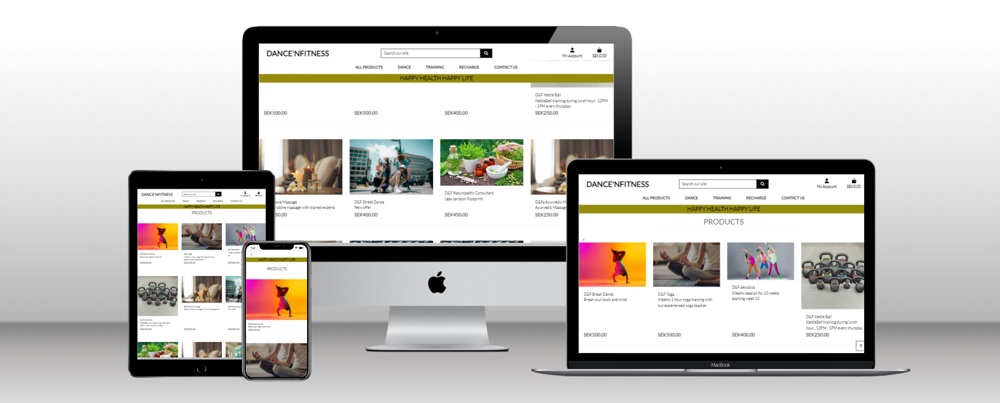
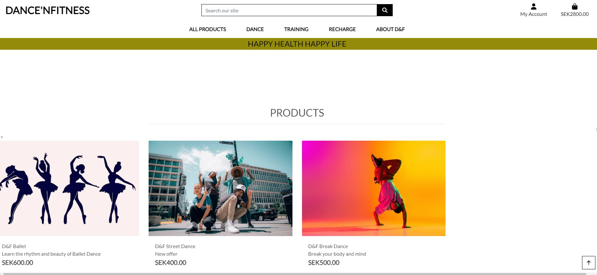
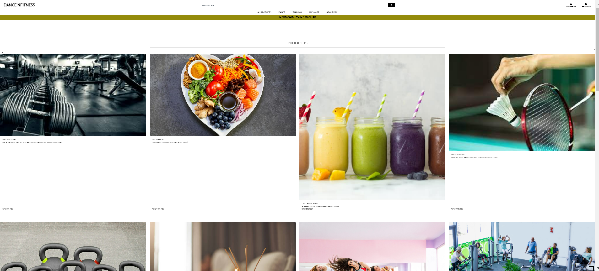
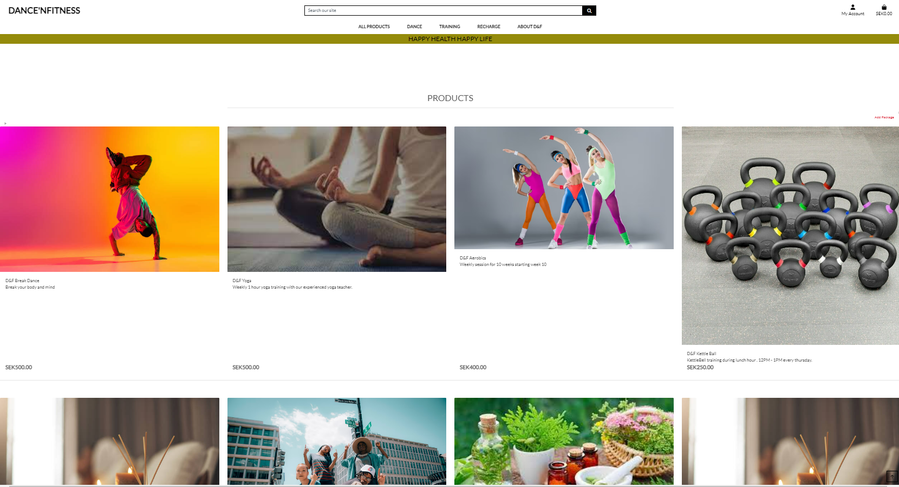
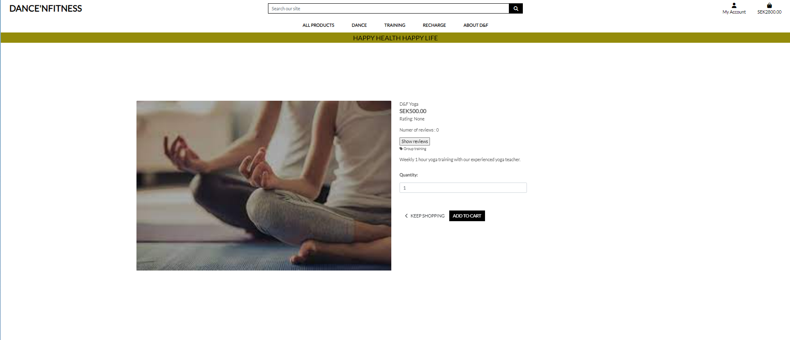
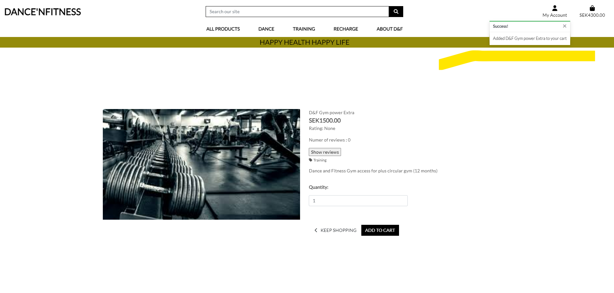

# DanceAndFitness - Fitness Center
<br>
<hr>

<h3 align="center">Full-Stack Project- E-Commerce(HTML5, CSS3, Bootstrap, Django, Python, JavaScript, jQuery, PostgreSQL, Cloudinary, Heroku)</h3>


TABLE OF CONTENTS

  - [Overview](#overview)
  - [UX](#ux)
  - [Business Model](#business-model)
  - [Marketing](#marketing)
  - [Agile Methodology](#agile-methodology)
  - [Features](#features)
  - [Responsive Layout and Design](#responsive-layout-and-design)
  - [Tools Used](#tools-used)
  - [Testing](#testing)
  - [Deployment](#deployment)
  - [Credits](#credits)
  - [Acknowledgements](#acknowledgements)

## Overview
DanceAndFitness is an e-commerce website created for a fictive Fitness center, located in Älmhult, Sweden. The main purpose of the project was to implement a fully functional online system so  that will make the process of selecting and purchasing fitness center packages for all.<br>
The users are given the possibility to see every package details, Read reviews, add items to the shopping cart, purchase with an online payment and access orders' history. Also, the site admin have opportunity to add new package/set new price and descriptions of a package if necessary.<br>
The website was developed using Python(Django), HTML, CSS and JavaScript. The data was stored in a PostgreSQL database using ElephantSql for manipulation.
<br><br>
The fully deployed project can be accessed at [D&F](https://dancenfitness-708b83044c2d.herokuapp.com/).<br><br>

## UX
This site was created respecting the Five Planes Of Website Design:<br>
### Strategy<hr>
**User Stories:** <br>

|   EPIC                                ||                                User Story                                                   |
| :-------------------------------------|--|:------------------------------------------------------------------------------------------- |
|**Base Setup**             |  ||
|                                       || As an admin I need to create a base.html so that I can load the template in all other pages. |             
|                                       || As a developer I need to deploy the base project in Heroku app so that I can avoid unexpected issues|
|                                       || As a user I should be redirected to 404.html so that page not found error is handled|
|                                       || As a user I can browse through the navigation bar so that I can sort/search thrpugh the packages easily|
|                                       || As a developer I need to setup cloudinary storage so that I can store media files|
|                                       || As a user I should provide user a 500.html page so that users are redirected to the home page in case of internal server errors|
|**AUTENTHICATION**   |  || 
|                                       || As a user I must be able to register to the danceandfitness* so that I can buy packages|
|                                       || As a user, I want to be able to confirm my account with an email|
|                                       || As a dveloper I want to implement allauth functions so that an user can register/login and perfrom other tasks sign in tasks|
|                                       || As a user/admin, I want to be able to log out at any time|
|**PRODUCTS**                           |  ||
|                                       || As an user I can view the product catalogue so that I can choose the right product|
|                                       || As a **user ** I can read the product details so that I can choose the package|
|                                       || As a user I can search a package in home page so that I can find a package easily|
|                                       || As a user I can sort packages so that I can choose packages|
|                                       || As an admin I can add new package so that I can add new offers for user|
|                                       || As a super user I can update the price and description of a package so that I can change the offer to make it more attractive|
|**CART**                                |  ||
|                                       || As a user I can add items to cart so that I can checkput when I am ready|
|                                       || As a user I can update items in cart so that I can change my shopping list|
|                                       || As a user I can remove item from cart so that I can remove item from my shopping list|
|                                       || As a user I can back to shopping from cart so that my cart is updated each time I update my shopping items|
|                                       || As a user I should be notfied when a item is added/updated/removed from cart so that I get a confirmation message|
|**CHECKOUT&PAYMENT**                           |  ||
|                                       || As a user I can proceed to secure checkout so that I can buy the health packages|
|                                       || As a user I can pay with my credit card so that I can buy the packages|
|                                       || As a developer I need to setup stripe account so that I can manage user payment|
|**USER MANAGEMENT**                       |  ||
|                                       || As a user I can submit the contact form so that I can get in touch with the service provide also subscribe to newsletters|
|                                       || As a user I need to I should be able to save personal details so that my profile is saved for every purchases|
|                                       || As a user I can view my order history so that I know my previous purchases|
|                                       || As a user I can view my order history so that I know my previous orders|
|                                       || As a user I can see my order history under my profile so that I can see me previous order details|
|**Testing & Documentation**                |  ||
|                                       || As a developer I need to write readme.md so that I can clearly explain my project|
|                                       || As a developer I must write a testing.md so that all my tests are well described|


**Project Goal:**<br>
Create an e-commerce application for DanceAndFitness that is useful for clients and site admins as well.

**Project Objectives:**<br> 
* To create a website with a simple and intuitive User Experience;
* To add content that is relevant and helps create a better image of the fitness center;
* To differentiate between user and admin accounts;
* To implement fully functional features that will ease the site admin to add new packages and exciting offers;
* To make a fully responsive website available and functional on every device.<br><br>

### Scope <hr>
**Simple and intuitive User Experience**<br>
* Ensure the navigation menu is visible and functional at every step;
* Ensure every page has a suggestive name that fits its content;
* Ensure the users will get visual feedback when navigating through pages;
* Create a design that matches the requirements of an e-commerce website.

**Relevant content**<br>
* Add a representative cover image;
* Add the website title and details about its purpose;
* Add a section that includes information about the center's name, description, location and contact details; #TO DO
* Make a clear and beautiful designed presentation of the menu elements;

**Features for upgraded experience**<br>
* Create a list with all the products and group them by category;
* Create a Cart feature that allows the user to add, update and remove products from the shopping cart;
* Create a Review feature that displays all the reviews added for a product and allows the user to add and edit his review;
* Create a Checkout feature for giving the user the possibility to complete an order on the website;
* Create a Profile page for the user to add/update his delivery details and see his orders' history;
* Create a feature for the site admin to add/edit products on the website;

### Structure<hr>
The structure of the website is divided into multiple pages and the content is displayed depending on authentication and client/admin type of user. <br>
- **Register/Login** pages give the user the possibility to create an account and authenticate for accessing different features.<br>
- **Logout** feature is a drop down under account that helps user exit their current account;<br>
- The **Home** page is visible for both types of users and provides a button the explore all packages<br>
- The **All products** page displays the card with all the products available to book;<br>
- The **Product details** page displays full specifications for a package and gives access to the <b>Review</b> feature. It also includes a feature for  adding the product to cart;<br>
- The **Profile** page is only available for authenticated users gives access to personal informations and orders' history;<br>
- The **Profile order  history details** page gives access to the user to full specifications only for orders placed by him/her.<br>
- The **Cart** page displays all the items added in the shopping bag with associated features also provides possibilities to add/remove/update product from cart;<br>
- The **Checkout page** includes an order summary and a form for personal, delivery and payment details;<br>
- The **Checkout success** page displays full specification for the successful order;<br>

**FLOWCHARTS**<br>
The Flowchart for my program was created using <b>LucidChart</b> to help me keep track and visually see how the system works. Due to the nature of development, and room for creativity, the final website has minor 
deviations from this flowchart. To be specific, the addition of three more features: "About", "Faqs" and "Contact".<br><br>
<br><br>

### Skeleton<hr>


**Database**<br>
The project uses the PostgreSQL relational database for storing the data.<br>

<details>
  <summary> Schema</summary>
<br>
</details>


### Surface<hr>

#### Fonts
* The fonts I used for this site were imported from [Google Fonts](https://fonts.google.com/):<br>
**Body:** *Alice, serif*<br>
**Logo:** *Yesteryear, cursive*<br>
**Custom error page:** *Josefin Sans, sans-serif*

## Business Model

* The business model chosen for this project is <b>Business to Customer</b>, as the main purpose of the website is to deliver final products to customers. This model was implemented using an interactive, attractive and intuitive interface that gives the clients an upgraded experience for shopping.<br><br>


* The DanceAndFitness center offers a diverse selections of dance and fitness packages categorised as *All Products*, *Dance* (Dances are further sub-categorised to Indian, western, and Fitness), *Training* (Trainings are further sub-categorised to GYM, Sports, and group trainings), *Recharge* (Reacharge are further sub-categorised to Food and Relax package).


## Marketing

### Facebook Page
* The marketing strategy includes a Facebook business page that is intended to create a good image of the bakeshop by posting news and promotions available. By highly promoting the products and always adding new content, the page will increase its popularity and attract more and more customers to buy from the online store. The page can be accessed at [this link](https://www.facebook.com/profile.php?id=61553025716191).<br><br><br>
*Note, this link may be broken as facebook regularly deletes inactive business pages.


## Search Engine Optimisation

I have created a sitemap and robots.txt file to help aid search engines locate the site. To keep user's information safe, any pages that could contain sensitive information has been disallowed in the robots.txt.

The purpose of the About Us page was not so much designed in mind to inform the user, but more so to have an opportunity to use some keywords, and link the user to any other relevant website, all to help boost the site's ranking in search engine results.

The initial keywords and phrases I came up with were:<br>
### Short Tail Keywords
 * Indian Dance
 * Street Dance
 * Modern Dance
 * GYM
 * Fitness
 * Healthy Eating
 * Spa
 * Massages
 * Group Training
 * Zumba
 * Aerobics
 * Naturopathy
 * Badminton <br>

### Long Tail Keywords
 * Dance and Fitness
 * Health Packages
 * Happy Health Happy Life
 * Stay Healthy

[Back to top ⇧](#overview)

## Agile Methodology
This project was developed utilising the Agile Methodogy.<br>
I prioritized features by labeling them such as "must-have", "could-have", "should have", and moved some less critical ones to future development. To guide my development process, I created user stories. These stories helped to define the features and functionalities that were most important to project's target audience.

As a student solo developer who was learning a lot during development, I faced challenges in estimating the time required for each task and only had a basic concept of what I would be able to create at a given timeframe. Therefore, I kept things simple and focused on achievable goals. Aiming for Minimum Viable Product, or MVP. All the features and functionalities that I wanted to have but I didn't manage to finish because of time constraints were moved to "Future Enhancement". With the goal of implementing them on the projects future release.

To keep track of progress, I used Github Projects(). I used a kanban board () divided into following sections: "to do", "in progress" "done" that allowed me to visualize all tasks and prioritize next steps. However, I could not find the "epics" feature in GitHub Projects, only milestones it provides only [milestones and issues](). Epics are supposed to be larger in scope than milestones, representing a significant amount of work. Milestones, on the other hand, are meant to mark significant points in time in terms of project completion. In this document, I added as epics, but on the project board, I used only [milestones]() to stay in order with GitHub's features.

By using Agile methodology, I was able to stay organized, work efficiently and focused on delivering the most important features, while also allowing flexibility for future development. This experience gave me invaluable insight and lessons that I can apply to future projects.


<br> <br>


<details>
<summary><strong>Sprints Details</strong></summary>

* **Sprint 1**<br>
    -Setup Django<br>
    -Setup Storage in cloudinary<br>
    -Implement Allauth<br>
    -Create Navbar<br>
    -Search and view package<br>
    -Deploy on heroku<br><br>
* **Sprint 2**<br>
    -Register New User<br>
    -Create User Profile <br>
    -Create a navigation menu<br>
    -View review and rating<br>
    -Add , update and remove cart<br>
    <br><br>
* **Sprint 3**<br>
    -See order history<br>
    -Update Package Details by admin<br>
    -Add Package Details by admin<br><br>
    -Implement user option to read all reviewa<br>
    -Implement user option to back to shopping<br>
    -Implement user option to add product review<br>
    <br><br>
* **Sprint 4**<br>
    -Add toasts for user notifications<br>
    -view order histroy link<br> 
    -Complete user payment<br>
    -Complete user checkout<br>
    -Complete user contact from submission<br>
    -Add a feature for adding products to the shopping bag from the *Details* page<br>
    -Implement feature for admin to delete product<br>
    <br><br>
* **Sprint 5**<br>
    -Create 500.html page<br>
    -Create 404.html<br>
    -Add about us page<br>
    -Write testing and readme.md<br>
    <br><br>
</details><br><br>


## Features
### Existing Features<hr>
#### Products
Every user can access the page with the product catalogue. The items are listed attractively and their design is adapted to all devices.

* On NavBar with a drop down options, there is a section for filtering and sorting.<br>
    The filters can be selected from a dropdown with all the values existing in the list of items displayed. When a user selects a filter, its value is added to a list of *active filters* and the list updates accordingly. Any active filter can be removed and the list will return to its initial state.<br><br>
    <br><br>

    The sorting feature is available for the user by selecting a value from the available options from NavBar that will update the package' list accordingly.<br><br>
    <br><br>
* User has a seearch bar in product home page, where user can search with a product name or any keyword, if the key word matches the product name or description , then the products are dispalyed..
 <br><br>

* All the products are listed as card elements which include relevant information for the users.<br><br>
<br><br>

* Every products has a *details page* that includes full specifications.<br><br>
<br><br>

#### Product Reviews
* On the *Package Details* page there is a list with all the reviews posted on the website and it is visible to all types of users. All the reviews have the same design and type of content. Important details are displayed such as *Name*, *Date and time*, *Stars rating* and the *Message* posted.<br><br>
<br><br>

* On the *Package Details* page there is a list with all the reviews posted on the website and it is visible to all types of users. All the reviews have the same design and type of content. Important details are displayed such as *Name*, *Date and time*, *Stars rating* and the *Message* posted.<br><br>
<br><br>

* When a user is authenticated and he never posted a review, a form is provided for leaving a message and a star rating.<br><br>
<br><br>

* For authenticated users that already posted a review, the page displays the values of their review and the possibility to update it.<br><br>
The form for editing the review already contains the corresponding message value and the star ratings in the initial state.<br><br>
<br><br>
<br><br>

#### Cart
* A feature for adding a product to the shopping bag has been created and included in the *Products*, *Product Details* and *Wishlist* pages. This is a form for updating the products existing in the shopping bag and also their quantity.
* In the *Bag* page there's a list of the added items with details about quantity and price. Any item can be removed by clicking on the bin icon and also the quantity can be updated.<br><br>
<br><br>

#### Checkout
* The *Checkout* page represents the final step in completing the order.<br>
A form for personal, delivery and payment details is displayed for the user to fill in with valid data. As the delivery is available only for Cork - Ireland, the fields *Country, County and City* are filled by default with values and can't be edited by the user from the interface. Additionally, a validation has been implemented to not allow other values to be submitted. The form has validation for the phone number field as well to match an Ireland format. The payment input has its own Stripe-implemented validation.<br><br>
<br><br>
* An order summary is displayed with details about the products and cost.
* After the order is completed, the user is sent to a *Checkout Success * page with full specifications and details.

#### Payment
* Underneath the delivery details is the card payment box which is run by Stripe.
* Only numbers can be entered into the card payment box. Incorrect card numbers will automatically show an 
  invalid card number error.
* The site can be tested by using the dummy card number 4242 4242 4242 4242 with the expiry date 04/24 and the CVC code 242.
* At the end of the section is a button to complete the order or to return back to the bag. There is also a warning message informing the user of how much their card is about to be charged.<br><br>
<br><br>

[Back to top ⇧](#overview)
#### Webhooks
* Using the Stripe website, webhooks have been set up to confirm an order goes through after payment.
* Once an order is placed, a webhook will search the database to confirm the order exists. If it cannot find the  original order, it will create one using the information provided by the user in the original instance.<br><br>
<br><br>

#### About Us
* The about us page shows the location and opening hours of the fitness center.<br><br>
<br><br>

* On the left hand side of the image are some fictional information of how Madison's Patisserie came to be. This was used to create an opportunity to use keywords related to the site's business to help boost search ratings.<br><br>
<br><br>

#### Contact
* The contact page has the image of the fictional cafe of the bakeshop. The contact info has all the relevant information such as address, telephone number and email address.
* It also contains the cafe's  opening hours as well as google map that has the marker set to the fictional address of the bakeshop's cafe.
* The *Contact* page was created with the aim of providing the users all the relevant information about the bakeshop's contact details, opening hours and location without needing to contact the bakeshop.<br><br>
<br><br>


#### User Profile
The *User Profile* page gives the user access to individual and private features.<br>
* The page includes a form for adding or updating the delivery details. These details are saved in the database and whenever the user is logged in and wants to make an order, the values will be automatically set in the checkout form. <br><br>
<br><br>

* Another important feature is the **Orders history** which is represented by a table with all the orders made by the user. <br><br>
<br><br>
Each order item has a details page that can be accessed by clicking on the order number value.<br><br>
<br><br>

#### Admin
The admin account was created as a superuser account from the terminal and also has access to the admin panel.<br>
* There is a page created especifically created for staff members to keep better track of all the orders placed on the website.<br>
<br><br>
The orders are displayed in a custom-designed table, grouped by day and ordered by time. The page renders by default the orders for the current day. 

* A form is provided for filtering the orders by date for a better user experience.<br><br>
<br><br>

* Every order has a delete button that triggers a confirmation modal and gives access to a full details page by clicking on the order_number value <br><br>
<br><br>

* An admin user have access to features for *adding a new product*, *edit a product's details* and *delete product*. 
<br><br>

* The last two implementations are available on the *Product Details* page and only for staff accounts.<br><br>
<br><br>
<br><br>

#### FAQs Page
The *FAQs* page was created with the aim of providing the users all the relevant information  and answers to all their frequently asked questions without needing to contact the bakeshop.<br><br>
<br><br>

#### Toasts
* Toasts appear in the top right-hand corner of the display informing the user of any actions they have performed.
<br><br>

### Future Feature Considerations<hr>

## Responsive Layout and Design
The project design has been adapted to all types of devices using Bootstrap predefined breakpoints. For intermediate devices where the design didn't fit accordingly, custom breakpoints were used.

**Breakpoints:**

    - max-width:380px(extra small devices)
    - max-width:768px(small devices)
    - max-width:992px(medium devices)
    - min-width:1024px and max-width: 1024px(IpadPro)
    - max-width:1200px(large devices)

**Tested devices:**

    - iPhone SE 
    - Ipad
    - Samsung Galaxy S22
    - Samsung Galaxy S8 
    - Galaxy Note 2 

## Tools Used

[GitHub](https://github.com/) - used for hosting the source code of the program<br>
[Gitpod](https://gitpod.io/workspaces) - for project development and testing the code<br>
[Heroku](https://dashboard.heroku.com/) - used for deploying the project<br>
[LucidChart](https://www.lucidchart.com/) - used for creating the Flowchart and Database relational schema<br>
[Favicon.io](https://favicon.io/) - used for generating the website favicon<br>
[Diffchecker](https://www.diffchecker.com/) - used for comparing the code<br>
[TinyPNG](https://tinypng.com/) - for compressing the images<br>
[Grammarly](https://app.grammarly.com/) - for correcting text content<br>
[Font Awesome](https://fontawesome.com/) - for creating atractive UX with icons<br>
[Bootstrap5](https://getbootstrap.com/) - for adding predifined styled elements and creating responsiveness<br>
[Google Fonts](https://fonts.google.com/) - for typography<br>
[JsHint](https://jshint.com/) - used for validating the javascript code<br>
[CI Phython Linter](https://pep8ci.herokuapp.com/) - used for validating the python code<br>
[HTML - W3C HTML Validator](https://validator.w3.org/#validate_by_uri+with_options) - used for validating the HTML<br>
[CSS - Jigsaw CSS Validator](https://jigsaw.w3.org/css-validator/#validate_by_uri) - used for validating the CSS<br>
[W.A.V.E.](https://wave.webaim.org/) - for testing accessibility<br>
[CLOUDINARY](https://cloudinary.com/) - for storing media and static data<br>
[ElephantSql](https://www.elephantsql.com/) - for hosting the PostgresSql database migrated from Heroku
[pixelied](https://pixelied.com/convert/jpg-converter/jpg-to-webp) - for converting the images to webp format.
Gmail - for sending emails using the SMTP server

### Python packages

*


[Back to top ⇧](#overview)

## Testing
The comprehensive testing documentation can be found here [TESTING.MD](TESTING.MD)

## Deployment

The app was deployed to heroku for the first time as soon as  django 
installation was completed to make sure that everything is working correctly.

## Database (ElephangSQL)

1. Navitate to [ElephantSQL website](https://www.elephantsql.com/), log in to your account
2. In top-right corner click on green button "Create New Instance".
3. Enter database name, leave plan field as is, optionaly enter tags.
4. Select region, click on "Review" and then on "Create instance".
5. Go to your dashboard, find newly created database instance, click on it.
6. Copy URL starting with "postgress://"
7. Paste this URL into env.py file as DATABASE_URL value and save the file.

  ```python
  os.environ["DATABASE_URL"] = "postgres://yourLinkFromDatabaseDashboard"
  ```

## Cloudinary

Cloudinary storage is used to store all static and media files.

1. Navigate to [Clodinary website](https://cloudinary.com/) log in to your account.
2. Go to 'Setting' and copy the user API secret.

```python
  os.environ["CLOUDINARY_URL"]="cloudinary://yoursecretfromcloudinary"
  ```


## Django secret key

In order to protect django app secret key it was set as anviroment variable and stored in env.py. Please change your password accordingly.

```python
os.environ["SECRET_KEY"] = "yourSecretKey"
```

## GitHub and Gitpod

Note: Repository was created using Code Institute template: [https://github.com/Code-Institute-Org/gitpod-full-template](https://github.com/Code-Institute-Org/gitpod-full-template)

1. Login to Github and navigate to repository: [https://github.com/Rupa830904/PP5-DanceAndFitness](https://github.com/Rupa830904/PP5-DanceAndFitness)

2. Click on "Fork button" in upper-right corner and create a new form in your own account.

3. Open your repository in local IDE or using Gitpod. Preferred way is to used [Chrome Gitpod Extension](https://chrome.google.com/webstore/detail/gitpod-always-ready-to-co/dodmmooeoklaejobgleioelladacbeki). When you install extension, green "Gitpod" button appears in your repository. Click on it to cread new workspace.

4. Go to workspace terminal and install all requirements using command: "pip install -r requirements.txt". All te packages will be installed. requirements.txt content:

```text
asgiref==3.7.2
cloudinary==1.36.0
dj-database-url==2.1.0
dj3-cloudinary-storage==0.0.6
Django==3.2.21
django-allauth==0.41.0
django-cloudinary-storage==0.3.0
django-countries==7.5.1
django-crispy-forms==1.14.0
django-pandas==0.6.6
gunicorn==21.2.0
install==1.3.5
numpy==1.26.1
oauthlib==3.2.2
pandas==2.1.2
Pillow==10.1.0
psycopg2==2.9.9
python3-openid==3.2.0
pytz==2023.3.post1
requests-oauthlib==1.3.1
sqlparse==0.4.4
stripe==7.0.0
tzdata==2023.3
```

5. Local env.py file should be configured as on example below:

```python
import os

    # Env vars
    os.environ["DATABASE_URL"] = "postgres://yourLinkCopiedFromElephantSQLDashboard"
    os.environ["SECRET_KEY"] = "YourSecretKey"
    os.environ["CLOUDINARY_URL"]="cloudinary://yoursecretkey"
```

6. In order to save django changes in database migration needs to be made.

7. Use terminal commands:

    ```text
    python3 manage.py makemigrations --dry-run
    python3 manage.py makemigrations
    python3 manage.py migrate --plan
    python3 manage.py migrate
    ```

8. Create superuser to access admin area using terminal command (email is optional, password won't be visible when typing, confirm password twice):

    ```text
    python3 manage.py createsuperuser
    ```

9. App can be run in gitpod enviroment using terminal command:

    ```text
    python3 manage.py runserver
    ```

10. Go to Heroku and follow further instructions below.


### Deploy on Heroku

## Heroku

1. Navigate to [https://heroku.com/](https://heroku.com/) login to your account and open dashboard. Click button "New" and select "Create new app" button.

2. Enter app name, I used "danceandfitness", chose your region and click on "Create app" button.

3. Click on newly created app and go to "Deploy" tab and then to "Deployment method" section. Authorize and connect your GitHub account, then find and select your repository.

4. Go to the "Settings" tab, click on "Reveal Config Vars" and add the following keys and values (all values should be strings without any quotation marks):

NOTE: DISABLE_COLLECTSTATIC variable should be set to "1" for initial deployment. Before final deployment it should be removed.

    | Key                    | Value                                                            |
    |------------------------|------------------------------------------------------------------|
    | CLOUDINARY_URL         | Cloudinary Url with access key                    |
    | DATABASE_URL           | postgress url beginning with postgress://                        |
    | DISABLE_COLLECTSTATIC  | 1                                                                |                                                          |
    | SECRET_KEY             | YourSecretKey, the same as in env.py                             |


5. Return to your Gitpod workspace and navigate to the file `danceandfitness.settings.py`. Change allowed hosts including the name of the app that you created in previous steps. Save the file.

6. Procfile required to run project on Heroku was already created but if you change your app's name please make sure that this change is reflected in Procfile. It can be found in your project's main directory. In my case Procfile looks as below:

    ```python
    web: gunicorn danceandfitness.wsgi
    ```

7. After adding enviromental variables and editing Procfile project is ready for deployment. In Heroku app's dashboard navigate to "Deploy" tab, scroll down to "Manual deploy" section. Select main branch from dropdown menu and click on "Deploy Branch".

8. **Step required for final deployment:** Navigate again to app's settings, reveal config vars and delete DISABLE_COLLECTSTATIC entry if it was set before.

9. After build is done, you should be able to see the button with the link leading to deployed app. In my case [Live Link](https://dancenfitness-708b83044c2d.herokuapp.com/).

[Back to top ⇧](#overview)


### Stripe

Stripe is needed to handle the checkout process when a payment is made. You will need a stripe account which you can sign up for [here](https://stripe.com/en-gb).

#### Payments

1. To set up stripe payments you can follow their guide [here](https://stripe.com/docs/payments/accept-a-payment#web-collect-card-details).

#### Webhooks

1. To set up a webhook, sign into your stripe account and click 'Developers' located in the top right of the navbar.
2. Then in the side-nav under the Developers title, click on 'Webhooks', then 'Add endpoint'.
3. On the next page you will need to input the link to your heroku app followed by /checkout/wh/. It should look something like this:  
    ```
    https://your-app-name.herokuapp.com/checkout/wh/
    ```
4. Then click '+ Select events' and check the 'Select all events' checkbox at the top before clicking 'Add events' at the bottom. Once this is done finish the form by clicking 'Add endpoint'.
5. Your webhook is now created and you should see that it has generated a secret key. You will need this to add to your heroku config vars.
6. Head over to your app in heroku and navigate to the config vars section under settings. You will need the secret key you just generated for your webhook, in addition to your Publishable key and secret key that you can find in the API keys section back in stripe.
7. Add these values under these keys:  
    ```
    STRIPE_PUBLIC_KEY = 'insert your stripe publishable key'
    STRIPE_SECRET_KEY = 'insert your secret key'
    STRIPE_WH_SECRET = 'insert your webhooks secret key'
    ```
8. Finally, back in your setting.py file in django, insert the following near the bottom of the file:  
    ```
    STRIPE_PUBLIC_KEY = os.getenv('STRIPE_PUBLIC_KEY', '')
    STRIPE_SECRET_KEY = os.getenv('STRIPE_SECRET_KEY', '')
    STRIPE_WH_SECRET = os.getenv('STRIPE_WH_SECRET', '')
    ```

    <br>
### Fork the repository
For creating a copy of the repository on your account and change it without affecting the original project, use<b>Fork</b> directly from GitHub:
- On [My Repository Page](https://github.com/Rupa830904/PP5-DanceAndFitness), press <i>Fork</i> in the top right of the page
- A forked version of my project will appear in your repository<br></br>

### Clone the repository
For creating a clone of the repository on your local machine, use<b>Clone</b>:
- On [My Repository Page](https://github.com/Rupa830904/PP5-DanceAndFitness), click the <i>Code</i> green button, right above the code window
- Chose from <i>HTTPS, SSH and GitClub CLI</i> format and copy (preferably <i>HTTPS</i>)
- In your <i>IDE</i> open <i>Git Bash</i>
- Enter the command <code>git clone</code> followed by the copied URL
- Your clone was created
<hr>

## Credits
### Content
* The content of the website is fictive but was loosely based on the project owner's personal experience. 

### Code
* The whole project was built utilising Code Institute's LMS. More specifically the 'Boutique-ado, 'Hello Django' and 'I think Therefore I Blog' walkthrough projects.
* Daisy McGirr Django Youtube Tutorials (https://www.youtube.com/watch?v=dCvkAVN5uas&list=PLXuTq6OsqZjYSa-lrjd5wMGl23zpnhvln)

## Acknowledgements
- Code Institute for all the materials and support offered.<br>
- My mentor Gareth McGirr for all the advice and support and always went above and beyond to help me as much as possible with the problems encountered during the development of the project.<br>
- Code Institute tutor's help support and guidance throughout the project.<br>
<br>

<hr>

[Back to top ⇧](#overview)
