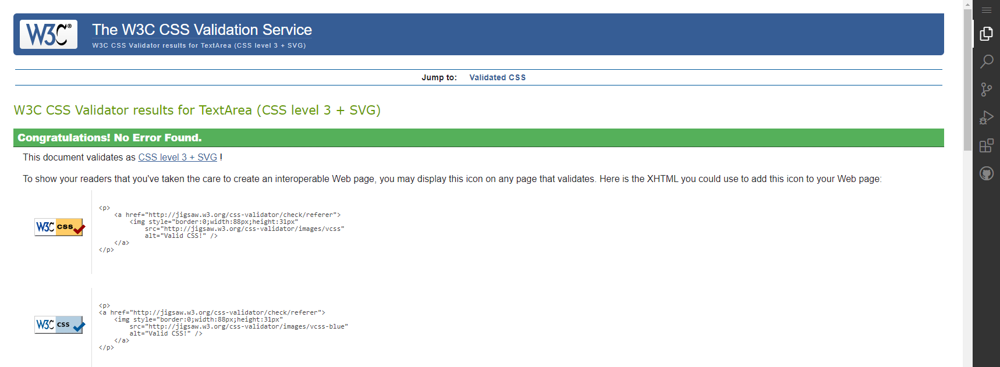

# Testing

Back to [README.MD](README.md) 

## Table of contents
* [User Story and Feature Testing](#user-story-and-feature-testing)
* [Automated View Testing](#automated-view-testing)
* [Browser Testing](#browser-testing)
* [Code Validation](#code-validation)
* [Bugs](#bugs)

## User Story and Feature Testing
All the user stories were tested manually comprehensively, including all the representative features, and were documented below with a summary of the steps made for demonstrating the validation of the tests:  

### EPIC - AUTHENTICATION
#### As a user I must be able to register to the danceandfitness* so that I can buy packages
* **Acceptance Criteria:** All auth function is implementes to provide new user to register.
* **Summary:** 
    - There is a Register page that provides a form with email, username and password for the user to fill in; 
    - When the user submits the form he is redirected to a page that informs him that he needs to verify his email to finalize the signup process; 
    - An info alert is displayed with the message "Confirmation e-mail sent to..." that suggests the user needs to verify his email.  

    *By testing all these features, it can be affirmed that the user story is accomplished.*  
* **Outcome:** Pass 

#### As a user I want to be able to confirm my account with an email so that I can authenticate my registration.
* **Acceptance Criteria:** User gets an email with confirmation link while registering.
* **Summary:** 
    - An email is sent to the user when he tries to register on the page; 
    - The email includes a link that will redirect him to a page from the shop website where he can confirm the email by clicking on a button.  

    *By testing all these features, it can be affirmed that the user story is accomplished.*  
* **Outcome:** Pass

#### As a user I want to be able to log out at any time
* **Acceptance Criteria:** User is prompted with logout confirmation button and upon clicking that user is logged out.
* **Summary:**    
    - There is a Logout modal that can be triggered when clicking on the hyperlink in the navbar. The modal is implemented as part of a defensive programming;  
    - The logout modal asks the user again if he wishes to log out of the current account;  
    - A success alert is displayed with the message "Logged out" that confirms to the user that he has been successfully logged out.   
    
    *By testing all these features, it can be affirmed that the user story is accomplished.* 
* **Outcome:** Pass

### EPIC - PRODUCTS
#### As an user I can view the product catalogue so that I can choose the right product
* **Acceptance Criteria:** A buuton is enabled on the 'Home' page to direct to product page and view all products..
* **Summary:**  
   - In the navigation menu there are separate links that redirect the user to the products' catalogue. These links are classified as: <em>All products</em> 
    - Also there is a 'Explore Now' button in the home page which lands into All products page.

    *By testing this feature, it can be affirmed that the user story is accomplished.*  
* **Outcome:** Pass

#### As a user I can sort packages so that I can choose packages
* **Acceptance Criteria:** Sort function implemented under drop down in Nav Bar..
* **Summary:** 
   - On the Nav Bar user sort the prducts as:, <em>By Category</em>, <em>By Price</em>; <em>
    *By testing all these features, it can be affirmed that the user story is accomplished.*  
* **Outcome:** Pass

#### As a **user ** I can read the product details so that I can choose the package
* **Acceptance Criteria:** User is directed to product details page upon click on each packages/products.
* **Summary:** 
    - Every item listed on products' pages is clickable and it redirects to the selected product's details page; 
    - The details page includes the product's name, price, and a short description of the product;  

    *By testing all these features, it can be affirmed that the user story is accomplished.*  
* **Outcome:** Pass

#### As a super user I can update the price and description of a package so that I can change the offer to make it more attractive
* **Acceptance Criteria:** Super user has 'Edit Package' link and Edit form open to update package.
* **Summary:** 
    - When a user is logged in as admin, the page for product details provides a link for updating package details like price and description in a form. 
    - The form has validation that prevents the user to update a product with invalid information; 
    - Any update is reflected in the product's details page;  

    *By testing all these features, it can be affirmed that the user story is accomplished.*   
* **Outcome:** Pass

#### As an admin I can add new package so that I can add new offers for user
* **Acceptance Criteria:** An Add package form has been implemented for superuser.
* **Summary:** 
    - When a user is logged in as admin, the product catalogue page includes a link for <em>Add a new product</em>; 
    - When the link is clicked, it redirects to a form with fields for every detail of the product; 
    - After the form is submitted, the element is added to the products' list.  

    *By testing all these features, it can be affirmed that the user story is accomplished.*  
* **Outcome:** Pass

#### As a user I can search a package in home page so that I can find a package easily
* **Acceptance Criteria:** A search bar is implemented in the home page to search for package.
* **Summary:** 
    - User has a seearch bar in home page where the user can search for a product name or any matching description in product details. ; 
    *By testing all these features, it can be affirmed that the user story is accomplished.*  
* **Outcome:** Pass

#### As a user I can back to shopping from cart so that my cart is updated each time I update my shopping items
* **Acceptance Criteria:** A 'Keep Shopping' button is available for users to go back to shopping and cart info is saved in the session.
* **Summary:** 
    - On the <em>Product Details</em> page, for every product in the table there is a button 'KEEP SHOPPING' to continue shopping; 
   
    *By testing all these features, it can be affirmed that the user story is accomplished.*  
* **Outcome:** Pass
### EPIC - RATING&REVIEWS
#### As a user I can read detailed reviews so that I know more about the product
* **Acceptance Criteria:** A button implented in product detail page to read detailed user reviews..
* **Summary:** 
    - on product details page, there is a button 'Show reviews';  
    - Every review message is listed after clicking on that button.; 
    
    *By testing all these features, it can be affirmed that the user story is accomplished.*  
* **Outcome:** Pass

#### As a user I can review and rate a product so that I can give feedback
* **Acceptance Criteria:** A user feedback form has been implemented and available to user after login for all products.
* **Summary:**  
    - On the <em>Product details</em> page there is a section for "Write review" only visible for authenticated users. 
    - The form only contains inputs for product name, rating, and comment. 
    - There is no implementation for approval of the reviews for the purpose of full transparency; 
    - The response is immediate and the review appears as the on the list;   
    - The response is immediate and rating is changed as per the avg of all reviews   

    *By testing all these features, it can be affirmed that the user story is accomplished.*  
* **Outcome:** Pass 

#### As a user I can view total reviews and ratings of all packages so that I can choose the appropriate package.
* **Acceptance Criteria:** User can view reviews and ratings of all packages.
* **Summary:**  
    - A user can view num of reviews on product details page of every product. 
    - The rating is displayed on the product's details page and for every element listed on the products' pages. 

    *By testing all these features, it can be affirmed that the user story is accomplished.*  
* **Outcome:** Pass

### EPIC - CART
#### As a user I can add items to cart so that I can checkput when I am ready
* **Acceptance Criteria:** User has an option to add items to cart and cart info is saved for user's session.
* **Summary:** 
    - There is a <em>ADD TO CART</em> button on product details page 
    - Shoppic cart is updated with the added product on click.  

    *By testing all these features, it can be affirmed that the user story is accomplished.*  
* **Outcome:** Pass
#### As a user I can update items in cart so that I can change my shopping list
* **Acceptance Criteria:** User has a link to update item info in cart.
* **Summary:** 
   - On the <em>Shopping cart</em> page, for every product in the table there is a 'udpate link' visible only to users that are authenticated  
   - On click, it opens a box where user can update quantity and it is reflected on cart  

    *By testing all these features, it can be affirmed that the user story is accomplished.*  
* **Outcome:** Pass
#### As a user I should be notfied when a item is added/updated/removed from cart so that I get a confirmation message
* **Acceptance Criteria:** AUser gets a popup message for add/update/remove from cart.
* **Summary:** 
   - User gets a pop-up message for  actions like add/rmove item from cart.

    *By testing all these features, it can be affirmed that the user story is accomplished.*  
* **Outcome:** Pass
#### As a user I can remove item from cart so that I can remove item from my shopping list
* **Acceptance Criteria:**Use has a link to remove item from cart.
* **Summary:** 
   - On the <em>Shopping cart</em> page, for every product in the table there is a link for removing the product 
   - When the users click on the link, the product is removd from the cart; 

    *By testing all these features, it can be affirmed that the user story is accomplished.*  
* **Outcome:** Pass

### EPIC - CHECKOUT&PAYMENT
#### As a user I can pay with my credit card so that I can buy the packages
* **Acceptance Criteria:** user can provide the credit card details and pay for the bought packages.
* **Summary:** 
    - On the <em>Checkout</em> page there is a form section with fields for Credit Card payment authentication 

    *By testing all these features, it can be affirmed that the user story is accomplished.*  
* **Outcome:** Pass
#### As a user I can proceed to secure checkout so that I can buy the health packages
* **Acceptance Criteria:** Secure checkout option is enabled on shopping cart to proceed to checkout.
* **Summary:** 
    - On the <em>Checkout</em> page, there is a table with every product added to checkout; 
    - On the <em>Checkout</em> page, for every product in the table, the price per item is displayed; 
    - There is also an <em>Order Summary</em> section with full specifications about the total price.   
    
    *By testing all these features, it can be affirmed that the user story is accomplished.*  
* **Outcome:** Pass

### EPIC - USER MANAGEMENT
#### As a user I need to I should be able to save personal details so that my profile is saved for every purchases
* **Acceptance Criteria:** Profile app is created and user is offered the form to save personal details.
* **Summary:**   
    - On the <em>Profile</em> page, there is a form with fields for personal details; 
    
    *By testing all these features, it can be affirmed that the user story is accomplished.*  
* **Outcome:** Pass
#### As a user I can view my order history so that I know my previous purchases
* **Acceptance Criteria:** User can click on the previous order number and be directed to order details.
    - A logged in user On the <em>Profile</em> page, there is a table that includes a list of all the orders made by the authenticated user; 
    - Every order element displayed in the table contains link to see further details about the order.  
    *By testing all these features, it can be affirmed that the user story is accomplished.*  
* **Outcome:** Pass
#### As a user I can see my order history under my profile so that I can see me previous order details
* **Acceptance Criteria:** User is presented with the link to all previous orders under 'My Profile.'
* **Summary:**  
   - A logged in user On the <em>Profile</em> page, there is a table that includes a list of all the orders made by the authenticated user; 
   - Every order element displayed in the table contains link to see further details about the order.  

    *By testing all these features, it can be affirmed that the user story is accomplished.*  
* **Outcome:** Pass
#### As a user I can submit the contact form so that I can get in touch with the service provide also subscribe to newsletters
* **Acceptance Criteria:** User contact from is implemented for submit by the user.
    - The CONTACT US page of the website provides us the form to conatct D&F for any questions or subscribe for newsletters.  

     *By testing all these features, it can be affirmed that the user story is accomplished.*  
* **Outcome:** Pass

### Aditional Manual Testing
#### Error Handling

* Ensure that **403 HTTP** errors display custom 403.html.
    - **Stress Test:** Input a route in the URL for accessing another user content
* Ensure that **404 HTTP** errors display the custom 404.html.
    - **Stress Test:** Input a random route in the URL that can't be found in the declared paths of the project
* Ensure that **500 HTTP** errors display the custom 500.html.
    - **Stress Test:** Set debug to false and try to access a path that has been breaked intentionally.

#### Interface Interaction

* Ensure all interactive elements respond appropriately:
    - **Desktop:**
        - All navbar elements correctly respond to hovering.
        - All buttons correctly respond to hovering.
        - All authentication links correctly respond to hovering
    - **Mobile:**
        - All navbar elements correctly respond to touch.
        - All buttons correctly respond to touch.
        - All authentication links correctly respond to touch

#### Links

* Ensure the external links to social media present in the footer open up in new tabs.

## Browser Testing
The website was tested on different browser to ensure all features work accordingly.
* Chrome
* Edge
* Firefox

## Code Validation
### HTML

The html code of the website was validated using [W3 Markup Validator](https://validator.w3.org/). 
At the time of deployment the validation have the following outcome:  

  

The following pages have been tested:
* Home
* Products
* Product details
* Cart
* Checkout
* Checkout Success
* User Profile
* Admin Orders
* Contact
* About
* Login/Register
* 403/404/500 custom pages

### CSS

The CSS code was validated using [W3 Jigsaw Validator](https://jigsaw.w3.org/css-validator/) 
At the time of deployment the validation for *base.css* has the following outcome:  

  

  

### Javascript

The Javascript code was validated using using [JsHint](https://jshint.com/) 
At the time of deployment the validation for * *stripe_elements.js* have the following outcome: 

stripe_elements.js

  

* The warnings listed are caused by the EventListeners added to elements in a loop. 
I tried to solve the issue but no successful method has been found, so I chose to ignore the warning as it is not affecting the way my code works in any way.

### Python
The python code was tested using [Code Institute python linter](https://pep8ci.herokuapp.com/) online validator. 
At the time of deployment the python code validation have the following outcomes:  

Main App

  

Bag App

  

Checkout App

  

Contact App

  

Newsletter App

  

Product Reviews App

  

Products App

  

Profiles App

  

### Accesibility 
The accesibility of the website was tested with [Wave](https://wave.webaim.org/)

**Wave results:** 

Home page

  

Products page

  

Login page

  

Register page

  

About page

  

Contact page

The contact page result is showing one error about the map image missing alternative text. I tried to fix it but was unsuccessful.
  

FAQs Page

  

Bag Page

  

Admin Page

  

 

## BUGS
I encountered many challenges during the whole building process of this project. So much so, that I often forget to list them down here as a bug and just get my head stuck in solving them. But the ones listed below were the ones that really challenged my tenacity and patience.
### Solved
* **Update quantity in shopping cart page**
     When I added update cart feature in cart page I struggled a lot to update the quantity and reflect that in my cart session. 
     Solution:
     I took help from CI tutors to solve and understand the  update cart view and corrected the flow to update the cart session.

* **Stripe Element not working as expected**
     When I implemented stripe payments and try to check that everything works, I could only go as far as 'Secure Checkout' but it wouldn't bring me to success checkout page as expected.
     Solution:
     I took help from CI tutors to solve and understand how stripe works and required variables are added on config vars.

* **reviews not showing in a table**
    When I had implemented reviews button I had a challenge to display them in a table. 
    Solution:
    I took help from CI tutors to solve and understand how I can dsiplay in bootstrap table and also can iterate the value over the output.

Back to [README.MD](README.MD) 